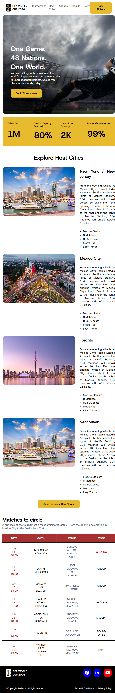

# ⚽ FIFA World Cup 2026 Landing Page

An interactive and responsive web landing page for the upcoming **FIFA World Cup 2026**, showcasing host venue insights, tournament schedules, stats counters, and ticket booking options.

---

## 🔗 Live Demo & Relevant Links
* **Live Website:** [fifa_world_cup_2026 Live](https://rayhan612007.github.io/fifa_world_cup_2026/)
* **GitHub Repository:** [fifa_world_cup_2026 Repo](https://github.com/rayhan612007/fifa_world_cup_2026)

---

## 📸 Preview


---

## ✨ Main Features
* **Hero Banner & Ticket Booking:** Prominent call-to-action for ticket pre-orders with real-time stats (1M+ tickets sold).
* **Host Cities Overview:** Detailed cards for venues like New York/New Jersey, Mexico City, Toronto, and Vancouver.
* **Key Match Schedule:** Highlighting key fixtures from opening games to the final at MetLife Stadium.
* **Responsive Layout:** Clean design built for desktop viewports.

---

## 🛠️ Technology Stack
* **HTML5:** Semantic structural layout.
* **CSS3:** Custom styles, CSS Grid/Flexbox layouts, and typography.

---

## 📦 Dependencies
* **Font Awesome & Google Fonts:** Integrated for UI icons and modern typography.

---

## 💻 How to Run Locally

Follow these steps to run the project on your local machine:

1. **Clone the repository:**
   ```bash
   git clone [https://github.com/rayhan612007/fifa_world_cup_2026.git](https://github.com/rayhan612007/fifa_world_cup_2026.git)
